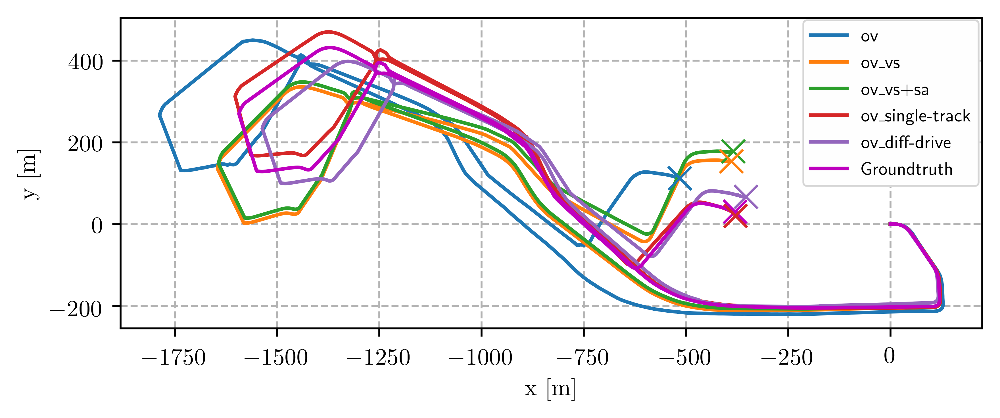
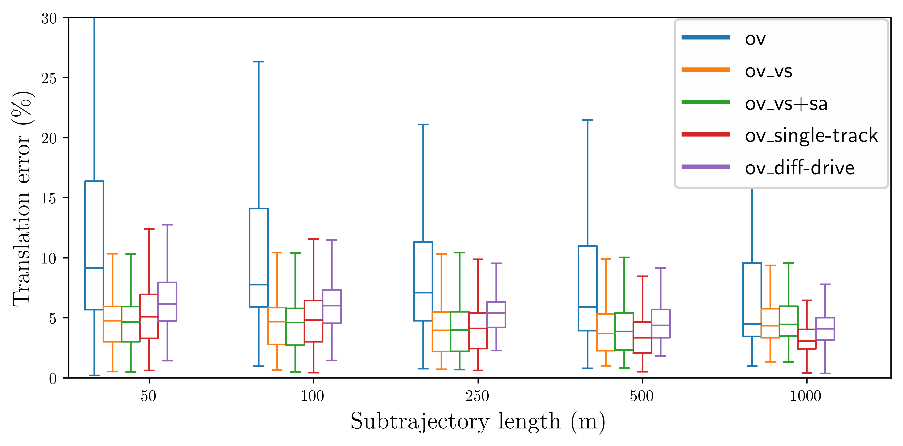

# OpenVINS Vehicle Updates

This is the official implementation of the paper [Visual-Inertial Odometry aided by Speed and Steering Angle Measurements](https://ieeexplore.ieee.org/document/9841243). It enables OpenVINS to use speed, steering angle, and wheel speeds measurements in different variants for ground vehicles such as cars or wheeled robots. 

## Usage
This code is currently tested on Ubuntu 18.04 and ROS 1 and the monocular camera IMU setup. ROS 2 implementation is available soon. Additional speed and steering measurements are supplied with a [stamped Ackermann drive message](http://docs.ros.org/en/jade/api/ackermann_msgs/html/msg/AckermannDriveStamped.html) available from standard ROS packages on the topic `/ackermann0`. When using wheel speed measurements and the differential drive model you need to use the [custom Wheel speeds message](https://github.com/aserbremen/open_vins/blob/master/ov_core/msg/WheelSpeeds.msg) on the topic `/wheel_speeds0` added to `ov_core`. 

Different vehicle-related updates are set with the ros parameter `vehicle_update_mode`. The best performing method for cars is `VEHICLE_UPDATE_PREINTEGRATED_SINGLE_TRACK`. The other options are given in the following enum:
```c++
  enum VehicleUpdateMode {
    // Basic OpenVINS algorithm without vehicle updates
    VEHICLE_UPDATE_NONE,
    // Basic OpenVINS algorithm with speed update, propagating the state at every speed measurement
    VEHICLE_UPDATE_SPEED_PROPAGATE,
    // Basic OpenVINS algorithm with steering update, propagating the state at every steering measurement
    VEHICLE_UPDATE_STEERING_PROPAGATE,
    // Basic OpenVINS algorithm with speed and steering update, propagating the state at every speed and steering measurement
    VEHICLE_UPDATE_SPEED_AND_STEERING_PROPAGATE,
    // Basic OpenVINS algorithm with 3DOF odometry (x, y, yaw) update using single track model
    VEHICLE_UPDATE_PREINTEGRATED_SINGLE_TRACK,
    // Basic OpenVINS algorithm with 3DOF odometry (x, y, yaw) update using differential drive model
    VEHICLE_UPDATE_PREINTEGRATED_DIFFERENTIAL,
    // When the mode is not known we exit the program
    VEHICLE_UPDATE_UNKNOWN,
  };
```
### ROS 1 Usage
I added new launch files for the serial usage [serial_vehicle_updates.launch](https://github.com/aserbremen/open_vins/blob/master/ov_msckf/launch/serial_vehicle_updates.launch) and regular topic subscription method [subscribe_vehicle_updates.launch](https://github.com/aserbremen/open_vins/blob/master/ov_msckf/launch/subscribe_vehicle_updates.launch). Take a look at them for an overview of the additional vehicle-related parameters.

To run the algorithm on a rosbag use the following command:

<code>roslaunch ov_msckf serial_vehicle_updates.launch bag:=/path/to/bag.bag vehicle_update_mode:=VEHICLE_UPDATE_PREINTEGRATED_SINGLE_TRACK path_est:=/path/to/OpenVINS-format/result.txt path_rpg_est:=/path/to/RPG_trajectory_evaluation-format/stamped_traj_estimate.txt path_time:=/path/to/computation-time-results.txt</code>

Note that I added the parameter `path_rpg_est` to output the results in a format that enables the usage of the [rpg_trajectory_evaluation](https://github.com/uzh-rpg/rpg_trajectory_evaluation) toolbox.

### ROS 2 Usage available soon

## Different updating schemes

The following image display the different updating schemes for vehicle-related measurements. Speed and steering measurements can be used whenever the respective measurement arrives. The time scheme is displayed in the center column of the image. Furthermore, speed and steering measurements in conjunction as well as wheel speed measurements can be used to perform a preintegrated odometry update, much like the visual update of the Multi-State Constraint Kalman Filter. This updating scheme is represented on the right column.

<p align="center">
  
</p>

### Single-track and differential drive model
Two kinematic motion models are applied: the single-track model and the differential drive model. While both can be used for cars, the first one is better suited and reports lower odometry errors in our experiments. The latter can be used for wheeled robots which do not supply steering angle information. 

<p align="center">
  
</p>


In the following table all updating methods and their corresponding `vehicle_update_mode`, legend entry for subsequent plots, and applied motion models are summarized: 

| vehicle_update_mode | legend | Update frequency | Motion model | 
| :------------ | :--------- | :-------------: | :-------------: |
| VEHICLE_UPDATE_NONE | ov | N/A | N/A | 
| VEHICLE_UPDATE_SPEED_PROPAGATE | ov_vs | CAN sensor | N/A |
| VEHICLE_UPDATE_SPEED_AND_STEERING_PROPAGATE | ov_vs+sa | CAN sensor | single-track |
| VEHICLE_UPDATE_PREINTEGRATED_SINGLE_TRACK | ov_single-track | camera ensor | single-track |
| VEHICLE_UPDATE_PREINTEGRATED_DIFFERENTIAL | ov_diff-drive | camera sensor | differential drive |


### Results

A top view plot for a typical urban drive of roughly 4 kilometers and a median speed of 38 km/h is displayed here. The end points of each algorithm are marked with crosses. ov_single-track performs the best.
<p align="center">
  
</p>

A relative translation error plot for the given dataset displays the typical performance of each variant. The estimation results are aligned multiple times for the given subtrajectory lengths and the error metrics are calculated.  

<p align="center">
  
</p>

## Citation

For more details refer to our paper and if you use this work please cite the following:
```txt
@Conference{Serov2022Fusion,
  Title      = {Visual-Inertial Odometry aided by Speed and Steering Angle Measurements},
  Author     = {Andreas Serov and Joachim Clemens and Kerstin Schill},
  Booktitle  = {IEEE 25th International Conference on Information Fusion (Fusion)},
  Year       = {2022},
  Address    = {Linköping, Sweden},
  Url        = {\url{https://github.com/aserbremen/open_vins}}
}
```
If you have any question, don't hesitate to open an issue. 

## Original Credit / Licensing

This code is based on OpenVINS by the [Robot Perception and Navigation Group (RPNG)](https://sites.udel.edu/robot/) at the
University of Delaware. For researchers that have leveraged or compared to this work, please cite the
following:

```txt
@Conference{Geneva2020ICRA,
  Title      = {{OpenVINS}: A Research Platform for Visual-Inertial Estimation},
  Author     = {Patrick Geneva and Kevin Eckenhoff and Woosik Lee and Yulin Yang and Guoquan Huang},
  Booktitle  = {Proc. of the IEEE International Conference on Robotics and Automation},
  Year       = {2020},
  Address    = {Paris, France},
  Url        = {\url{https://github.com/rpng/open_vins}}
}
```

The codebase and documentation is licensed under the [GNU General Public License v3 (GPL-3)](https://www.gnu.org/licenses/gpl-3.0.txt).
You must preserve the copyright and license notices in your derivative work and make available the complete source code with modifications under the same license ([see this](https://choosealicense.com/licenses/gpl-3.0/); this is not legal advice).


